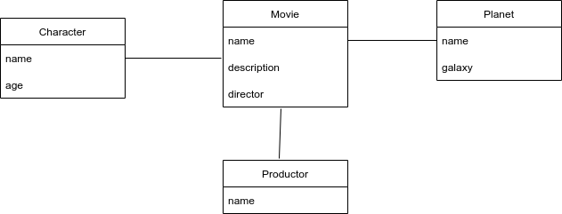

# Gearplug

### Install Packages

Open the terminal and in the Gearplug folder run:

> $ python3 -m venv venv

> $ source venv/bin/activate

> $ pip install -r requirements.txt

### Set Up

On the terminal in the Gearplug folder run the next commands to set up the environment for work:

> $ python manage.py makemigrations

> $ python manage.py migrate

### Run the code
To run the code:

> $ python3 manage.py runserver

### Test Manually
To Test the app Run the code after that go to **localhost:8000/starwars/** and try, for example:

[http://127.0.0.1:8000/starwars/character/](http://127.0.0.1:8000/starwars/character/)

### Run the test
To run the code :

> $ python manage.py test

### API Modelling

### Endpoints

There are three endpoints:

The one of these is:

[http://127.0.0.1:8000/starwars/character/](http://127.0.0.1:8000/starwars/character/)

This endpoint is the resposible for list the characters and create de new characters.

The another one is:

[http://127.0.0.1:8000/starwars/planet/](http://127.0.0.1:8000/starwars/planet/)

This endpoint is the resposible for create de new planet.

The last one is:

[http://127.0.0.1:8000/starwars/movie/](http://127.0.0.1:8000/starwars/movie/)

This endpoint is the resposible for create de new planet.
